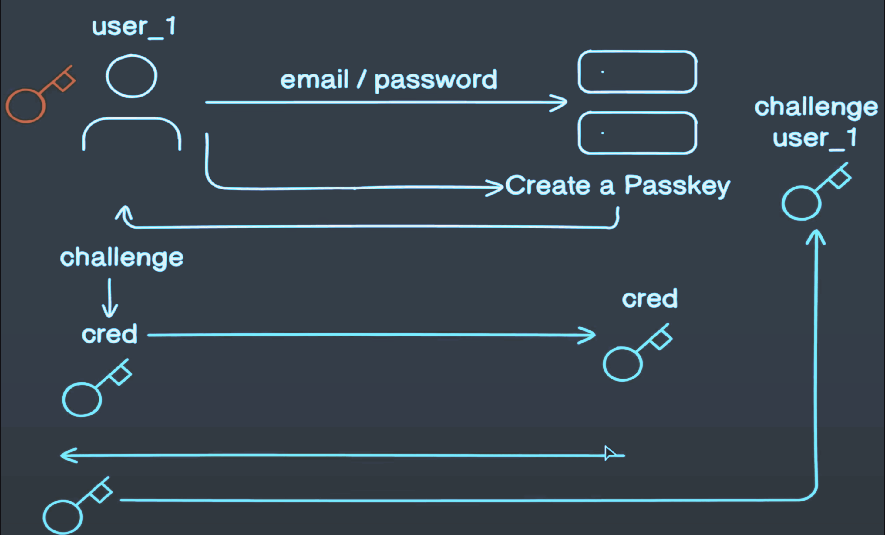

# Mockups

# Descritopion for flow

After successfully creating a using and storing its info on DB.

Create a passkey => app.post('/register-challenge':
User can request to create a passkey, backend will send a challenage to Client side, on sussessfull creation that challenge will
be stored on Backend as a passkey in this call app.post('/register-verify' using this function verifyRegistrationResponse

so later on, how to do login
user request to login => BE respond with that user challenge => user will verify that like provide the request cred
then that request passed to BE which is on this app.post('/login-verify and gets veriftied using verifyAuthenticationResponse
